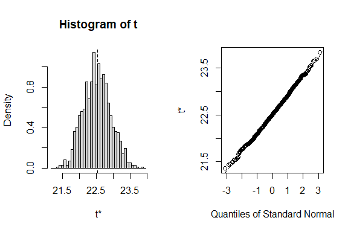

House Price Prediction Model
================
Trevor Okinda

- [Author Details](#author-details)
- [Setup Chunk](#setup-chunk)
- [Understanding the Dataset (Exploratory Data Analysis
  (EDA))](#understanding-the-dataset-exploratory-data-analysis-eda)
  - [Loading the Dataset](#loading-the-dataset)
    - [Source:](#source)
    - [Reference:](#reference)
  - [Measures of Frequency](#measures-of-frequency)
  - [Measures of Central Tendency](#measures-of-central-tendency)
  - [Measures of Distribution](#measures-of-distribution)
  - [Measures of Relationship](#measures-of-relationship)
  - [ANOVA](#anova)
  - [Univariate Plots](#univariate-plots)
  - [Multivariate Plots](#multivariate-plots)
- [Preprocessing and Data
  Transformation](#preprocessing-and-data-transformation)
  - [Check for Missing Values](#check-for-missing-values)
- [Training the model](#training-the-model)
  - [Data Splitting](#data-splitting)
  - [Boostrapping](#boostrapping)
  - [Cross-validation](#cross-validation)
  - [Model Training](#model-training)

# Author Details

|                       |                              |
|-----------------------|------------------------------|
| **Student ID Number** | 134780                       |
| **Student Name**      | Trevor Okinda                |
| **BBIT 4.2 Group**    | C                            |
| **Project Name**      | House Price Prediction Model |

# Setup Chunk

**Note:** the following KnitR options have been set as the global
defaults: <BR>
`knitr::opts_chunk$set(echo = TRUE, warning = FALSE, eval = TRUE, collapse = FALSE, tidy = TRUE)`.

More KnitR options are documented here
<https://bookdown.org/yihui/rmarkdown-cookbook/chunk-options.html> and
here <https://yihui.org/knitr/options/>.

# Understanding the Dataset (Exploratory Data Analysis (EDA))

## Loading the Dataset

### Source:

The dataset that was used can be downloaded here: *\<<a
href="https://www.kaggle.com/datasets/fedesoriano/the-boston-houseprice-data\"
class="uri">https://www.kaggle.com/datasets/fedesoriano/the-boston-houseprice-data\</a>\>*

### Reference:

*\<Avagyan, Z. (2017). Weather CSV \[Data set\]. Kaggle.
<a href="https://www.kaggle.com/datasets/zaraavagyan/weathercsv\"
class="uri">https://www.kaggle.com/datasets/zaraavagyan/weathercsv\</a>\>  
Refer to the APA 7th edition manual for rules on how to cite datasets:
<https://apastyle.apa.org/style-grammar-guidelines/references/examples/data-set-references>*

``` r
# Load dataset
HousingData <- read.csv("boston.csv", colClasses = c(
  CRIM = "numeric",
  ZN = "numeric",
  INDUS = "numeric",
  CHAS = "factor",  # Corrected from "numeric" to "factor"
  NOX = "numeric",
  RM = "numeric",
  AGE = "numeric",
  DIS = "numeric",
  RAD = "numeric",
  TAX = "numeric",
  PTRATIO = "numeric",
  B = "numeric",
  LSTAT = "numeric",
  MEDV = "numeric"
))

# Display the dataset
View(HousingData)
```

## Measures of Frequency

``` r
#Measures of frequency
# Summary statistics for numeric variables
summary(HousingData)
```

    ##       CRIM                ZN             INDUS       CHAS         NOX        
    ##  Min.   : 0.00632   Min.   :  0.00   Min.   : 0.46   0:471   Min.   :0.3850  
    ##  1st Qu.: 0.08205   1st Qu.:  0.00   1st Qu.: 5.19   1: 35   1st Qu.:0.4490  
    ##  Median : 0.25651   Median :  0.00   Median : 9.69           Median :0.5380  
    ##  Mean   : 3.61352   Mean   : 11.36   Mean   :11.14           Mean   :0.5547  
    ##  3rd Qu.: 3.67708   3rd Qu.: 12.50   3rd Qu.:18.10           3rd Qu.:0.6240  
    ##  Max.   :88.97620   Max.   :100.00   Max.   :27.74           Max.   :0.8710  
    ##        RM             AGE              DIS              RAD        
    ##  Min.   :3.561   Min.   :  2.90   Min.   : 1.130   Min.   : 1.000  
    ##  1st Qu.:5.886   1st Qu.: 45.02   1st Qu.: 2.100   1st Qu.: 4.000  
    ##  Median :6.208   Median : 77.50   Median : 3.207   Median : 5.000  
    ##  Mean   :6.285   Mean   : 68.57   Mean   : 3.795   Mean   : 9.549  
    ##  3rd Qu.:6.623   3rd Qu.: 94.08   3rd Qu.: 5.188   3rd Qu.:24.000  
    ##  Max.   :8.780   Max.   :100.00   Max.   :12.127   Max.   :24.000  
    ##       TAX           PTRATIO            B              LSTAT      
    ##  Min.   :187.0   Min.   :12.60   Min.   :  0.32   Min.   : 1.73  
    ##  1st Qu.:279.0   1st Qu.:17.40   1st Qu.:375.38   1st Qu.: 6.95  
    ##  Median :330.0   Median :19.05   Median :391.44   Median :11.36  
    ##  Mean   :408.2   Mean   :18.46   Mean   :356.67   Mean   :12.65  
    ##  3rd Qu.:666.0   3rd Qu.:20.20   3rd Qu.:396.23   3rd Qu.:16.95  
    ##  Max.   :711.0   Max.   :22.00   Max.   :396.90   Max.   :37.97  
    ##       MEDV      
    ##  Min.   : 5.00  
    ##  1st Qu.:17.02  
    ##  Median :21.20  
    ##  Mean   :22.53  
    ##  3rd Qu.:25.00  
    ##  Max.   :50.00

``` r
# Frequency distribution for categorical variables
table(HousingData$CHAS)  
```

    ## 
    ##   0   1 
    ## 471  35

## Measures of Central Tendency

``` r
#Measures of Central Tendency
# Calculate mean, median, and mode for RM (number of rooms)
mean_RM <- mean(HousingData$RM, na.rm = TRUE)
median_RM <- median(HousingData$RM, na.rm = TRUE)
mode_RM <- as.numeric(names(table(HousingData$RM))[which.max(table(HousingData$RM))])

cat("Measures of Central Tendency for RM (Number of Rooms):\n")
```

    ## Measures of Central Tendency for RM (Number of Rooms):

``` r
cat(paste0("Mean: ", round(mean_RM, 2)), "\n")
```

    ## Mean: 6.28

``` r
cat(paste0("Median: ", median_RM), "\n")
```

    ## Median: 6.2085

``` r
cat(paste0("Mode: ", mode_RM), "\n\n")
```

    ## Mode: 5.713

``` r
# Calculate mean, median, and mode for MEDV (Median value of owner-occupied homes in $1000s)
mean_MEDV <- mean(HousingData$MEDV, na.rm = TRUE)
median_MEDV <- median(HousingData$MEDV, na.rm = TRUE)
mode_MEDV <- as.numeric(names(table(HousingData$MEDV))[which.max(table(HousingData$MEDV))])

cat("Measures of Central Tendency for MEDV (Median Home Value):\n")
```

    ## Measures of Central Tendency for MEDV (Median Home Value):

``` r
cat(paste0("Mean: ", round(mean_MEDV, 2)), "\n")
```

    ## Mean: 22.53

``` r
cat(paste0("Median: ", median_MEDV), "\n")
```

    ## Median: 21.2

``` r
cat(paste0("Mode: ", mode_MEDV), "\n\n")
```

    ## Mode: 50

``` r
# Calculate mean, median, and mode for AGE (proportion of owner-occupied units built prior to 1940)
mean_AGE <- mean(HousingData$AGE, na.rm = TRUE)
median_AGE <- median(HousingData$AGE, na.rm = TRUE)
mode_AGE <- as.numeric(names(table(HousingData$AGE))[which.max(table(HousingData$AGE))])

cat("Measures of Central Tendency for AGE (Proportion of Units Built Prior to 1940):\n")
```

    ## Measures of Central Tendency for AGE (Proportion of Units Built Prior to 1940):

``` r
cat(paste0("Mean: ", round(mean_AGE, 2)), "\n")
```

    ## Mean: 68.57

``` r
cat(paste0("Median: ", median_AGE), "\n")
```

    ## Median: 77.5

``` r
cat(paste0("Mode: ", mode_AGE), "\n\n")
```

    ## Mode: 100

``` r
# Calculate mean, median, and mode for TAX (full-value property tax rate per $10,000)
mean_TAX <- mean(HousingData$TAX, na.rm = TRUE)
median_TAX <- median(HousingData$TAX, na.rm = TRUE)
mode_TAX <- as.numeric(names(table(HousingData$TAX))[which.max(table(HousingData$TAX))])

cat("Measures of Central Tendency for TAX (Property Tax Rate):\n")
```

    ## Measures of Central Tendency for TAX (Property Tax Rate):

``` r
cat(paste0("Mean: ", round(mean_TAX, 2)), "\n")
```

    ## Mean: 408.24

``` r
cat(paste0("Median: ", median_TAX), "\n")
```

    ## Median: 330

``` r
cat(paste0("Mode: ", mode_TAX), "\n\n")
```

    ## Mode: 666

## Measures of Distribution

``` r
# Calculate range, variance, and standard deviation for RM (number of rooms)
range_RM <- range(HousingData$RM, na.rm = TRUE)
variance_RM <- var(HousingData$RM, na.rm = TRUE)
sd_RM <- sd(HousingData$RM, na.rm = TRUE)

cat("Measures of Distribution for RM (Number of Rooms):\n")
```

    ## Measures of Distribution for RM (Number of Rooms):

``` r
cat(paste0("Range: ", paste(range_RM, collapse = " - ")), "\n")
```

    ## Range: 3.561 - 8.78

``` r
cat(paste0("Variance: ", round(variance_RM, 2)), "\n")
```

    ## Variance: 0.49

``` r
cat(paste0("Standard Deviation: ", round(sd_RM, 2)), "\n\n")
```

    ## Standard Deviation: 0.7

``` r
# Calculate range, variance, and standard deviation for MEDV (Median Home Value)
range_MEDV <- range(HousingData$MEDV, na.rm = TRUE)
variance_MEDV <- var(HousingData$MEDV, na.rm = TRUE)
sd_MEDV <- sd(HousingData$MEDV, na.rm = TRUE)

cat("Measures of Distribution for MEDV (Median Home Value):\n")
```

    ## Measures of Distribution for MEDV (Median Home Value):

``` r
cat(paste0("Range: ", paste(range_MEDV, collapse = " - ")), "\n")
```

    ## Range: 5 - 50

``` r
cat(paste0("Variance: ", round(variance_MEDV, 2)), "\n")
```

    ## Variance: 84.59

``` r
cat(paste0("Standard Deviation: ", round(sd_MEDV, 2)), "\n\n")
```

    ## Standard Deviation: 9.2

``` r
# Calculate range, variance, and standard deviation for additional variables in the Boston Housing dataset

# Calculate range, variance, and standard deviation for AGE (proportion of owner-occupied units built prior to 1940)
range_AGE <- range(HousingData$AGE, na.rm = TRUE)
variance_AGE <- var(HousingData$AGE, na.rm = TRUE)
sd_AGE <- sd(HousingData$AGE, na.rm = TRUE)

cat("Measures of Distribution for AGE (Proportion of Units Built Prior to 1940):\n")
```

    ## Measures of Distribution for AGE (Proportion of Units Built Prior to 1940):

``` r
cat(paste0("Range: ", paste(range_AGE, collapse = " - ")), "\n")
```

    ## Range: 2.9 - 100

``` r
cat(paste0("Variance: ", round(variance_AGE, 2)), "\n")
```

    ## Variance: 792.36

``` r
cat(paste0("Standard Deviation: ", round(sd_AGE, 2)), "\n\n")
```

    ## Standard Deviation: 28.15

``` r
# Calculate range, variance, and standard deviation for TAX (full-value property tax rate per $10,000)
range_TAX <- range(HousingData$TAX, na.rm = TRUE)
variance_TAX <- var(HousingData$TAX, na.rm = TRUE)
sd_TAX <- sd(HousingData$TAX, na.rm = TRUE)

cat("Measures of Distribution for TAX (Property Tax Rate):\n")
```

    ## Measures of Distribution for TAX (Property Tax Rate):

``` r
cat(paste0("Range: ", paste(range_TAX, collapse = " - ")), "\n")
```

    ## Range: 187 - 711

``` r
cat(paste0("Variance: ", round(variance_TAX, 2)), "\n")
```

    ## Variance: 28404.76

``` r
cat(paste0("Standard Deviation: ", round(sd_TAX, 2)), "\n\n")
```

    ## Standard Deviation: 168.54

## Measures of Relationship

``` r
# Calculate correlation between RM (number of rooms) and MEDV (Median Home Value)
correlation_RM_MEDV <- cor(HousingData$RM, HousingData$MEDV, use = "complete.obs")

cat("Measures of Relationship (Correlation) between RM and MEDV:\n")
```

    ## Measures of Relationship (Correlation) between RM and MEDV:

``` r
cat(paste0("Correlation Coefficient: ", round(correlation_RM_MEDV, 2)), "\n\n")
```

    ## Correlation Coefficient: 0.7

``` r
# Calculate correlation between AGE (proportion of units built prior to 1940) and TAX (property tax rate)
correlation_AGE_TAX <- cor(HousingData$AGE, HousingData$TAX, use = "complete.obs")

cat("Measures of Relationship (Correlation) between AGE and TAX:\n")
```

    ## Measures of Relationship (Correlation) between AGE and TAX:

``` r
cat(paste0("Correlation Coefficient: ", round(correlation_AGE_TAX, 2)), "\n\n")
```

    ## Correlation Coefficient: 0.51

## ANOVA

``` r
# Perform ANOVA for the "CHAS" variable against the "RM" variable (number of rooms)
anova_result <- aov(RM ~ CHAS, data = HousingData)

# Print the ANOVA table
cat("ANOVA Results for RM (Number of Rooms) vs CHAS:\n")
```

    ## ANOVA Results for RM (Number of Rooms) vs CHAS:

``` r
print(summary(anova_result))
```

    ##              Df Sum Sq Mean Sq F value Pr(>F)  
    ## CHAS          1   2.08  2.0759   4.232 0.0402 *
    ## Residuals   504 247.23  0.4905                 
    ## ---
    ## Signif. codes:  0 '***' 0.001 '**' 0.01 '*' 0.05 '.' 0.1 ' ' 1

## Univariate Plots

``` r
library(ggplot2)
# Assuming the dataset is already loaded as HousingData

# Univariate plot for RM (number of rooms)
ggplot(HousingData, aes(x = RM)) +
  geom_histogram(binwidth = 1, fill = "blue", color = "black", alpha = 0.7) +
  labs(title = "Distribution of RM (Number of Rooms)",
       x = "Number of Rooms",
       y = "Frequency")
```

<!-- -->

``` r
# Univariate plot for MEDV (Median Home Value)
ggplot(HousingData, aes(x = MEDV)) +
  geom_histogram(binwidth = 5, fill = "green", color = "black", alpha = 0.7) +
  labs(title = "Distribution of MEDV (Median Home Value)",
       x = "Median Home Value ($1000s)",
       y = "Frequency")
```

<!-- -->

``` r
# Univariate plot for AGE (proportion of owner-occupied units built prior to 1940)
ggplot(HousingData, aes(x = AGE)) +
  geom_histogram(binwidth = 5, fill = "orange", color = "black", alpha = 0.7) +
  labs(title = "Distribution of AGE (Proportion of Units Built Prior to 1940)",
       x = "Age of Units",
       y = "Frequency")
```

<!-- -->

``` r
# Univariate plot for INDUS (proportion of non-retail business acres per town)
ggplot(HousingData, aes(x = INDUS)) +
  geom_histogram(binwidth = 1, fill = "purple", color = "black", alpha = 0.7) +
  labs(title = "Distribution of INDUS (Non-Retail Business Acres)",
       x = "Proportion of Non-Retail Business Acres",
       y = "Frequency")
```

<!-- -->

``` r
# Univariate plot for TAX (full-value property tax rate per $10,000)
ggplot(HousingData, aes(x = TAX)) +
  geom_histogram(binwidth = 10, fill = "red", color = "black", alpha = 0.7) +
  labs(title = "Distribution of TAX (Property Tax Rate)",
       x = "Property Tax Rate",
       y = "Frequency")
```

<!-- -->

``` r
# Univariate plot for LSTAT (% lower status of the population)
ggplot(HousingData, aes(x = LSTAT)) +
  geom_histogram(binwidth = 1, fill = "brown", color = "black", alpha = 0.7) +
  labs(title = "Distribution of LSTAT (Percentage of Lower Status)",
       x = "Percentage of Lower Status",
       y = "Frequency")
```

<!-- -->

## Multivariate Plots

``` r
# Multivariate plot for RM (number of rooms) and MEDV (Median Home Value)
ggplot(HousingData, aes(x = RM, y = MEDV)) +
  geom_point(color = "blue", alpha = 0.7) +
  labs(title = "Scatter Plot: RM vs MEDV",
       x = "Number of Rooms",
       y = "Median Home Value ($1000s)")
```

<!-- -->

``` r
# Multivariate plot for LSTAT (percentage of lower status) and MEDV (Median Home Value)
ggplot(HousingData, aes(x = LSTAT, y = MEDV)) +
  geom_point(color = "green", alpha = 0.7) +
  labs(title = "Scatter Plot: LSTAT vs MEDV",
       x = "Percentage of Lower Status",
       y = "Median Home Value ($1000s)")
```

<!-- -->

``` r
# Multivariate plot for AGE (proportion of units built prior to 1940) and TAX (property tax rate)
ggplot(HousingData, aes(x = AGE, y = TAX)) +
  geom_point(color = "purple", alpha = 0.7) +
  labs(title = "Scatter Plot: AGE vs TAX",
       x = "Age of Units",
       y = "Property Tax Rate")
```

<!-- -->

``` r
# Multivariate plot for NOX (nitric oxides concentration) and INDUS (proportion of non-retail business acres)
ggplot(HousingData, aes(x = NOX, y = INDUS)) +
  geom_point(color = "orange", alpha = 0.7) +
  labs(title = "Scatter Plot: NOX vs INDUS",
       x = "Nitric Oxides Concentration",
       y = "Proportion of Non-Retail Business Acres")
```

<!-- -->

``` r
# Multivariate plot for RAD (index of accessibility to radial highways) and TAX (property tax rate)
ggplot(HousingData, aes(x = RAD, y = TAX)) +
  geom_point(color = "red", alpha = 0.7) +
  labs(title = "Scatter Plot: RAD vs TAX",
       x = "Index of Accessibility to Radial Highways",
       y = "Property Tax Rate")
```

<!-- -->

``` r
# Multivariate plot for CRIM (per capita crime rate) and LSTAT (percentage of lower status)
ggplot(HousingData, aes(x = CRIM, y = LSTAT)) +
  geom_point(color = "purple", alpha = 0.7) +
  labs(title = "Scatter Plot: CRIM vs LSTAT",
       x = "Per Capita Crime Rate",
       y = "Percentage of Lower Status")
```

<!-- -->

# Preprocessing and Data Transformation

## Check for Missing Values

``` r
# Check for missing values in each column
missing_values <- colSums(is.na(HousingData))

# Print columns with missing values (if any)
columns_with_missing <- names(missing_values[missing_values > 0])
if (length(columns_with_missing) > 0) {
  cat("Columns with missing values:\n")
  print(columns_with_missing)
} else {
  cat("No missing values found in the dataset.\n")
}
```

    ## No missing values found in the dataset.

# Training the model

## Data Splitting

``` r
library(caret)
```

    ## Loading required package: lattice

``` r
# Set seed for reproducibility
set.seed(123)

# Create an index for splitting the dataset (70% for training, 30% for testing)
split_index <- createDataPartition(HousingData$MEDV, p = 0.7, list = FALSE)

# Split the dataset into training and testing sets
train_data <- HousingData[split_index, ]
test_data <- HousingData[-split_index, ]

# Display the dimensions of the training and testing sets
cat("Training set dimensions:", dim(train_data), "\n")
```

    ## Training set dimensions: 356 14

``` r
cat("Testing set dimensions:", dim(test_data), "\n")
```

    ## Testing set dimensions: 150 14

## Boostrapping

``` r
library(boot)
```

    ## 
    ## Attaching package: 'boot'

    ## The following object is masked from 'package:lattice':
    ## 
    ##     melanoma

``` r
# Set seed for reproducibility
set.seed(123)

# Define a function to compute the statistic of interest (e.g., mean of MEDV)
statistic_function <- function(data, indices) {
  subset_data <- data[indices, ]
  return(mean(subset_data$MEDV))
}

# Perform bootstrapping
boot_results <- boot(data = HousingData, statistic = statistic_function, R = 1000)

# Display bootstrap results
cat("Bootstrap Statistics:\n")
```

    ## Bootstrap Statistics:

``` r
print(boot_results)
```

    ## 
    ## ORDINARY NONPARAMETRIC BOOTSTRAP
    ## 
    ## 
    ## Call:
    ## boot(data = HousingData, statistic = statistic_function, R = 1000)
    ## 
    ## 
    ## Bootstrap Statistics :
    ##     original      bias    std. error
    ## t1* 22.53281 -0.01607372   0.4045557

``` r
# Plot the bootstrap distribution
plot(boot_results, type = "basic", col = "blue", pch = 20)
```

<!-- -->

## Cross-validation

``` r
library(caret)


# Set seed for reproducibility
set.seed(123)

# Define the training control for cross-validation
train_control <- trainControl(method = "cv", number = 10)  # 10-fold cross-validation

# Basic k-fold cross-validation
model_basic <- train(MEDV ~ ., data = HousingData, method = "lm", trControl = train_control)
print(model_basic)
```

    ## Linear Regression 
    ## 
    ## 506 samples
    ##  13 predictor
    ## 
    ## No pre-processing
    ## Resampling: Cross-Validated (10 fold) 
    ## Summary of sample sizes: 455, 456, 456, 456, 456, 456, ... 
    ## Resampling results:
    ## 
    ##   RMSE      Rsquared   MAE     
    ##   4.829796  0.7227732  3.368084
    ## 
    ## Tuning parameter 'intercept' was held constant at a value of TRUE

``` r
# Repeated k-fold cross-validation (5 repetitions)
model_repeated <- train(MEDV ~ ., data = HousingData, method = "lm", trControl = trainControl(method = "repeatedcv", number = 10, repeats = 5))
print(model_repeated)
```

    ## Linear Regression 
    ## 
    ## 506 samples
    ##  13 predictor
    ## 
    ## No pre-processing
    ## Resampling: Cross-Validated (10 fold, repeated 5 times) 
    ## Summary of sample sizes: 455, 455, 456, 456, 455, 455, ... 
    ## Resampling results:
    ## 
    ##   RMSE      Rsquared   MAE     
    ##   4.769444  0.7351754  3.374411
    ## 
    ## Tuning parameter 'intercept' was held constant at a value of TRUE

``` r
# Leave-One-Out Cross-Validation (LOOCV)
model_loocv <- train(MEDV ~ ., data = HousingData, method = "lm", trControl = trainControl(method = "LOOCV"))
print(model_loocv)
```

    ## Linear Regression 
    ## 
    ## 506 samples
    ##  13 predictor
    ## 
    ## No pre-processing
    ## Resampling: Leave-One-Out Cross-Validation 
    ## Summary of sample sizes: 505, 505, 505, 505, 505, 505, ... 
    ## Resampling results:
    ## 
    ##   RMSE      Rsquared   MAE     
    ##   4.870908  0.7191505  3.382797
    ## 
    ## Tuning parameter 'intercept' was held constant at a value of TRUE

## Model Training

``` r
library(caret)

# Assuming the dataset is already loaded as HousingData

# Set seed for reproducibility
set.seed(123)

# Define the training control for cross-validation
train_control <- trainControl(method = "cv", number = 10)

# Train a linear regression model
lr_model <- train(MEDV ~ ., data = HousingData, method = "lm", trControl = train_control)

# Display the trained model
print(lr_model)
```

    ## Linear Regression 
    ## 
    ## 506 samples
    ##  13 predictor
    ## 
    ## No pre-processing
    ## Resampling: Cross-Validated (10 fold) 
    ## Summary of sample sizes: 455, 456, 456, 456, 456, 456, ... 
    ## Resampling results:
    ## 
    ##   RMSE      Rsquared   MAE     
    ##   4.829796  0.7227732  3.368084
    ## 
    ## Tuning parameter 'intercept' was held constant at a value of TRUE
